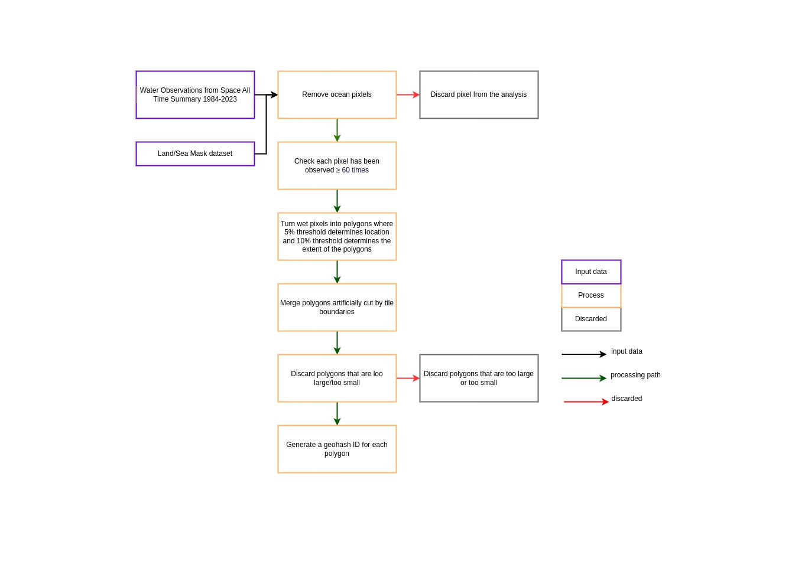
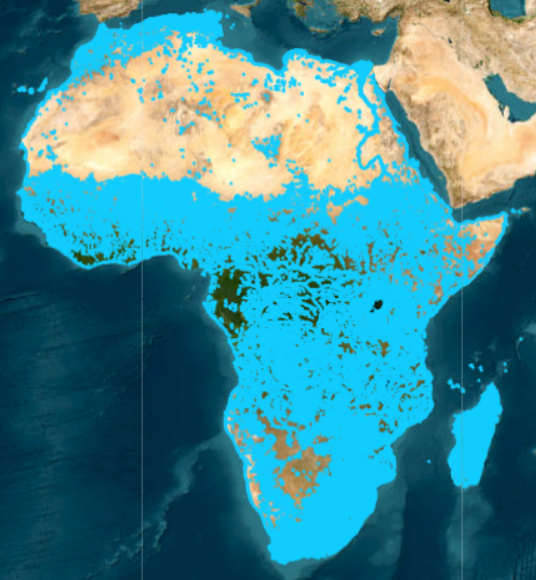

.. image:: figures/deafrica_logo_wide.jpg
  :width: 900
  :alt: Digital Earth Africa logo

Digital Earth Africa Waterbodies
###################################

.. image:: https://img.shields.io/badge/License-Apache%202.0-blue.svg
  :target: https://opensource.org/licenses/Apache-2.0
  :alt: Digital Earth Africa logo
  
.. image:: https://github.com/digitalearthafrica/deafrica-waterbodies/actions/workflows/lint.yml/badge.svg
  :target: https://github.com/digitalearthafrica/deafrica-waterbodies/actions/workflows/lint.yml
  :alt: Linting status
  
.. image:: https://github.com/digitalearthafrica/deafrica-waterbodies/actions/workflows/test.yml/badge.svg
  :target: https://github.com/digitalearthafrica/deafrica-waterbodies/actions/workflows/test.yml
  :alt: Testing status

**License:** The code in this repository is licensed under the `Apache License, Version 2.0 <https://www.apache.org/licenses/LICENSE-2.0>`_. Digital Earth Africa data is licensed under the `Creative Commons by Attribution 4.0 license <https://creativecommons.org/licenses/by/4.0/>`_.

**Contact:** If you need assistance with any of the Jupyter Notebooks or Python code in this repository, please post a question on the `Open Data Cube Slack channel <http://slack.opendatacube.org/>`_. If you would like to report an issue with this repo, or suggest feature requests, you can `open an issue on this repository <https://github.com/digitalearthafrica/deafrica-waterbodies/issues>`_. Non-technical questions about Digital Earth Africa Waterbodies can be sent to info@digitalearthafrica.org

. 

**Citing Digital Earth Africa Waterbodies:**

    Krause, Claire E.; Newey, Vanessa; Alger, Matthew J.; Lymburner, Leo. 2021. "Mapping and Monitoring the Multi-Decadal Dynamics of Australia’s Open Waterbodies Using Landsat" Remote Sens. 13, no. 8: 1437. https://doi.org/10.3390/rs13081437

----------

Up to date information about the extent and location of surface water across Africa provides stakeholders with a common understanding of this valuable and increasingly scarce resource. Water detection algorithms are now being routinely applied to continental and global archives of satellite imagery. However, water resource management decisions typically take place at the waterbody rather than pixel scale. 

This repository presents a workflow for generating polygons of persistent waterbodies from Landsat observations, enabling improved monitoring and management of water assets across Africa. We use `Digital Earth Africa’s (DE Africa) Water Observations from Space (WOfS) water classifier <https://docs.digitalearthafrica.org/en/latest/data_specs/Landsat_WOfS_specs.html>`_, which provides a water classified output for every available Landsat scene, to determine the spatial locations and extents of waterbodies across Africa. DE Africa Waterbodies uses Digital Earth Africa’s archive of over 30 years of Landsat satellite imagery to identify where almost 700,000 waterbodies are in the African landscape. 

*Digital Earth Africa Waterbodies workflow*

Each polygon was then used to generate a time series of WOfS, providing a history of the change in the wet surface area of each waterbody every ~16 days since 1984.

*Digital Earth Africa Waterbodies. Waterbody polygons mapped by this product are shown in blue. There are almost 700,000 across Africa.*

DE Africa Waterbodies supports users to understand and manage water across Africa. DE Africa Waterbodies provides new insights into local through to continental-scale surface water spatio-temporal dynamics by enabling the monitoring of important landscape features such as lakes and dams, improving our ability to use earth observation data to make meaningful decisions. It can be used to gain insights into the severity and spatial distribution of drought, or identify potential water sources.
For more information about the DE Africa Waterbodies product, including instructions for accessing the product, frequently asked questions and data download links, see the `Digital Earth Africa Data Catalogue <https://docs.digitalearthafrica.org/en/latest/data_specs/Waterbodies_specs.html>`_.

Installation
------------

DE Africa Waterbodies has some requirements which can be installed with pip:

.. code-block:: bash

    pip install --extra-index-url="https://packages.dea.ga.gov.au" -r requirements.txt
    
Once you have installed the requirements for DE Africa Waterbodies, install the module locally:

.. code-block:: bash

    pip install -e .
    
This command installs an editable version of the module in the current location.

A command line interface is available for generating wet area time series for a given shapefile. You can call the help for this interface from the command line using:

.. code-block:: bash

    deafrica-waterbodies --help
