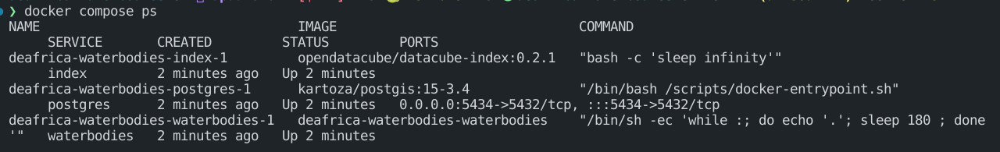

# DE Africa Waterbodies testing readme

## Setting up Docker for testing

- We use `docker compose` to manage the test infrastructure (packages and environment) .
- Use the command `make test-env` from the root directory to set up and launch the test environment. This sets up the test datacube and an environment to run `deafrica-waterbodies` in.
- You should have three containers running. You can check   this by running `docker compose ps` . 
- Now you can run tests in docker  .
- If the docker container needs rebuilding run `docker compose build` or `make build`
- Once you are done with testing, you can shut down the containers with `docker compose down` `make down` or  `make clean`

## Running tests in Docker

- Once containers are up, you can run testing with the command `docker compose exec waterbodies pytest`
- If you want to run the tests interactively and have access to the interactive debugger,
  Execute bash within the docker container waterbodies `docker compose exec waterbodies bash` or `make shell` and then run `pytest` from the code directory:

```bash
root@fe004etc:/code# pytest tests
```

## Running tests in sandbox

The tests assume that `deafrica-waterbodies` is installed. To install, follow the instructions in the [main README](../README.md). You can install `deafrica-waterbodies` locally for testing using `pip`:

```bash
jovyan@jupyter-:~/dev/deafrica-waterbodies$ pip install -e .
```

Remember the dot (.)!

To run tests, use `pytest` from the deafrica-waterbodies repository root, in the terminal:

```bash
jovyan@jupyter-:~/dev/deafrica-waterbodies$ pytest tests
```

Tests are automatically triggered in GitHub for any pushes to any branch. This behaviour is controlled by `/.github/workflows/test.yml`.

## Adding new test data

- The docker test datacube needs to have datasets in it to run tests on.
- To add a new test dataset, first make sure the product is indexed in the test datacube. This is done with a line like the following:

```bash
docker compose exec -T index datacube -v product add https://raw.githubusercontent.com/digitalearthafrica/config/master/products/wofs_ls_summary_alltime.odc-product.yaml
```

- Add the individual dataset with `s3-to-dc` inside the heredoc (with the others):

```bash
s3-to-dc "s3://deafrica-services/wofs_ls/1-0-0/189/038/2023/01/*/*.json" --stac --no-sign-request --skip-lineage 'wofs_ls'
```
